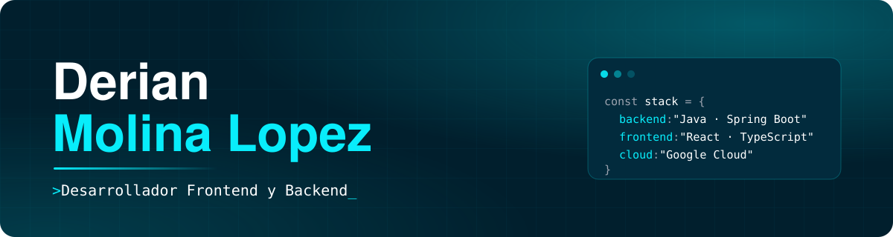

 
 

## `01` Sobre mí

Soy **Derian Molina Lopez**, ingeniero en sistemas computacionales con experiencia en creación, migración y documentación de sistemas legacy hacia la nube.

Me especializo en tecnologías empresariales —**Java, Spring Boot, Python y SQL**— sobre plataformas cloud como **Google Cloud**, y construyo interfaces con **JavaScript, TypeScript y React**. Trabajo en Windows y Linux, orientado al desarrollo e implementación de sistemas.

| | |
| :-- | :-- |
| **Formación** | Ing. en Sistemas Computacionales · Instituto Tecnológico de Culiacán (2020 – 2025) |
| **Especialidad** | Gestión de Tecnologías de Negocio |
| **Cloud** | Google Cloud · Azure · Kubernetes |
| **Ubicación** | Culiacán, Sinaloa, México |

## `02` Qué hago

- **Migro sistemas legacy a la nube.** Modernizo arquitecturas monolíticas hacia microservicios en Google Cloud con Java y Spring Boot.
- **Desarrollo aplicaciones full stack.** De la base de datos a la interfaz: APIs REST, persistencia e interfaces en React.
- **Implemento pagos y pedidos.** Flujos de compra con Stripe y gestión del ciclo de vida de cada pedido.
- **Pruebo y aseguro lo que entrego.** Pruebas de los componentes antes de producción y mitigación de vulnerabilidades.
- **Ordeno el flujo de entrega.** Estrategia de ramas en Git y reglas de CI/CD para entregas limpias a DevOps.

## `03` Tecnologías

**Frontend**

**Backend**

**Base de datos**

**Cloud y herramientas**

## `04` Proyecto destacado

### Agenda de un campo de golf
Aplicación web full stack, en producción. Los jugadores organizan sus salidas, invitan a otros jugadores y confirman su asistencia, mientras la administración controla la ocupación del campo, los horarios y las cuentas.

- **Agenda de jugadas:** 49 horarios de salida por día, con validación de disponibilidad.
- **Invitaciones por correo:** el anfitrión invita hasta 3 jugadores, con confirmaciones y avisos automáticos.
- **Titulares y referidos:** planes Individual y Familiar, con vínculos que aprueba el titular.
- **Panel de administración:** calendario de ocupación, gestión de cuentas y control de jugadas.
- **Cuentas seguras:** registro con confirmación por correo y recuperación de contraseña con código.

`Spring Boot` `React` `Tailwind CSS` `PostgreSQL`

## `05` GitHub

## `06` Contacto

¿Tienes una idea, una vacante o un proyecto en mente? Escríbeme y te respondo lo antes posible.

- **Correo:** [derianmolina220@gmail.com](mailto:derianmolina220@gmail.com)
- **LinkedIn:** [derian-molina](https://www.linkedin.com/in/derian-molina-3a41062b4/)
- **Portafolio:** [devianml.netlify.app](https://devianml.netlify.app/)
